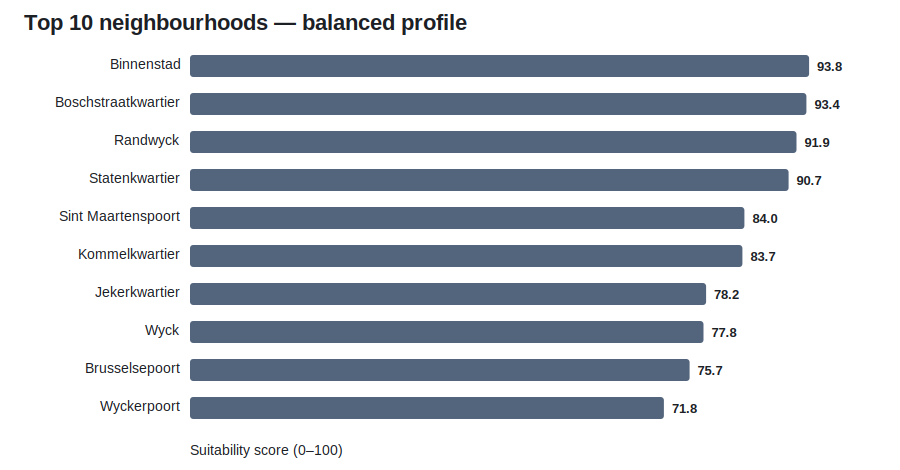

# Maastricht neighbourhoods for students

I study Business Analytics in Maastricht and wanted to compare neighbourhoods using public data rather than relying only on housing-platform descriptions.

The question is simple:

> Which Maastricht neighbourhoods have characteristics that could make them more suitable for students?

I used the 2025 CBS neighbourhood dataset and built a scoring model around six factors: the share of residents aged 15–24, rental housing, apartment housing, one-person households, average WOZ value, and distance to a large supermarket.

This is a neighbourhood comparison, not a live room finder. It does not know whether a room is currently available or what the advertised rent is.



## What I found

Under the balanced profile, the top five neighbourhoods are:

| Rank | Neighbourhood | Score |
|---:|---|---:|
| 1 | Binnenstad | 93.8 |
| 2 | Boschstraatkwartier | 93.4 |
| 3 | Randwyck | 91.9 |
| 4 | Statenkwartier | 90.7 |
| 5 | Sint Maartenspoort | 84.0 |

The rankings are sensitive to what a student values. For example, Jekerkwartier ranks 7th in the balanced model but 19th in the budget-focused model because its average WOZ value is relatively high.

That sensitivity is the main reason I included four profiles instead of presenting one ranking as objectively correct.

## Repository contents

- `src/download_data.py` downloads the CBS workbook.
- `src/pipeline.py` cleans the Maastricht data and calculates the scores.
- `src/scoring.py` contains the score normalisation and profile weights.
- `src/validate_data.py` checks the main assumptions and output ranges.
- `data/processed/neighbourhood_scores.csv` contains the current results.
- `sql/analysis_queries.sql` contains example SQL questions.
- `dashboard/index.html` reads the processed CSV and shows the four profiles.

## How the score works

The balanced profile uses these weights:

| Factor | Weight |
|---|---:|
| Student-age presence | 25% |
| Rental housing | 20% |
| Apartment housing | 15% |
| One-person households | 15% |
| Lower WOZ value | 15% |
| Supermarket access | 10% |

I gave the largest weight to student-age presence because I wanted the balanced profile to favour areas with an existing young-adult population. Rental housing received the next-largest weight because owner-occupied housing is generally less relevant to a student looking for a room.

The other factors are secondary characteristics rather than direct measures of room availability. The weights are subjective, so the dashboard also includes budget-focused, student-hub, and housing-availability profiles.

More detail is in [METHODOLOGY.md](METHODOLOGY.md).

## Run the project

```bash
python -m venv .venv

# Windows
.venv\Scripts\activate

# macOS/Linux
source .venv/bin/activate

pip install -r requirements.txt
python src/download_data.py
python src/pipeline.py
python src/validate_data.py
python -m http.server 8000
```

Then open `http://localhost:8000/dashboard/` in a browser. The small local server is needed because the dashboard reads the processed CSV rather than containing copied results.

## Important limitations

- Average WOZ value is not student rent. I use it only as a rough neighbourhood-level housing-value proxy.
- Residents aged 15–24 include non-students and exclude students older than 24.
- The dataset does not contain live listings, vacancy, room size, landlord rules, or furnished status.
- Neighbourhood averages hide variation between streets and individual properties.
- The current model does not include cycling time to a specific university faculty.

## What I would add next

The clearest next step is a time-stamped sample of advertised student rooms, including rent, room size, neighbourhood, furnished status, and listing date. That would replace the WOZ proxy with direct rental-market evidence and allow analysis of rent per square metre and listing volume.
